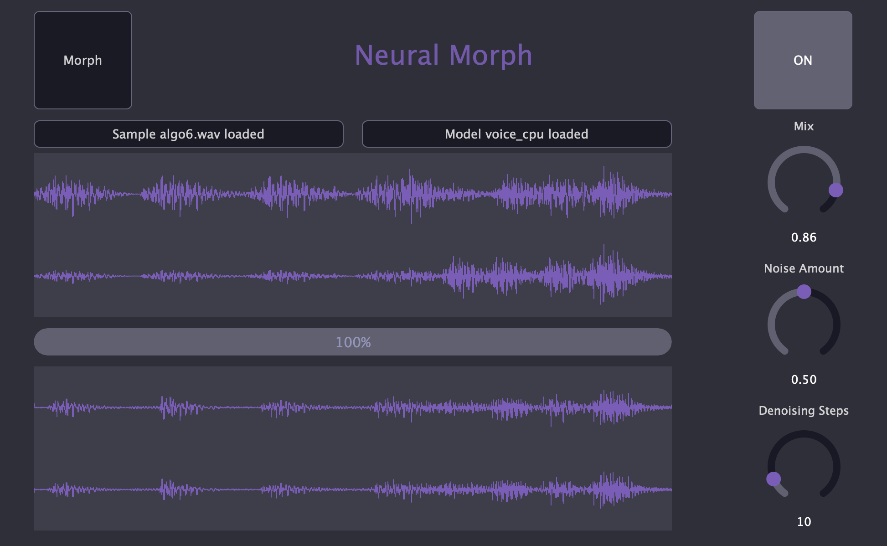

# Neural Morph
 Neural Morph is an audio instrument plugin which supports using Machine Learning to transform, blend, and play existing samples.\
 

## Installation

To install Neural Morph, you should make sure you have [CMake](https://cmake.org/download/) 3.15 or higher installed.

Then, you need to install [JUCE](https://github.com/juce-framework/JUCE) (you should clone the JUCE directory and then install via CMake, see [JUCE CMake documentation](https://github.com/juce-framework/JUCE/blob/master/docs/CMake%20API.md)) and [LibTorch](https://pytorch.org/cppdocs/installing.html).

In the `config` file, set `TORCH_CMAKE_PATH` as the absolute path of your libtorch install, `JUCE_CMAKE_PATH` as the absolute path of your JUCE install, `CMAKE_GENERATOR` as the generator for CMake (run `cmake -G` to see a full list of generators on your platform). 

Then, run the following command to build. 
```
sh build.sh
```

By default it will build Neural Morph as a standalone application, VST3, and AU plugins. The VST3 and AU will be copied to the default install location for audio plugins, and you can find your plugins directly in your DAW. You can find the standalone application in `build/NeuralMorph_artefacts/Release/Standalone`.

## Getting Models

Currently Neural Morph support [Dance Diffusion](https://github.com/Harmonai-org/sample-generator), you can try their model on [Replicate](https://replicate.com/harmonai/dance-diffusion).

You can fine-tune Dance Diffusion models with this notebook: [](https://colab.research.google.com/github/Harmonai-org/sample-generator/blob/main/Finetune_Dance_Diffusion.ipynb)

Run Dance Diffusion models and export it as torchscript model for Neural Morph: [](https://colab.research.google.com/github/alanzhu07/NeuralMorph/blob/main/Dance_Diffusion%2BNeural_Morph.ipynb)

You can also try some precompiled models [here](https://drive.google.com/drive/u/0/folders/1VSRcpRbBCUqmmRhMYBHgNfQGwSOHwVZc). To load any models, just select the `.pt` files after clicking on the "Select model to load".


